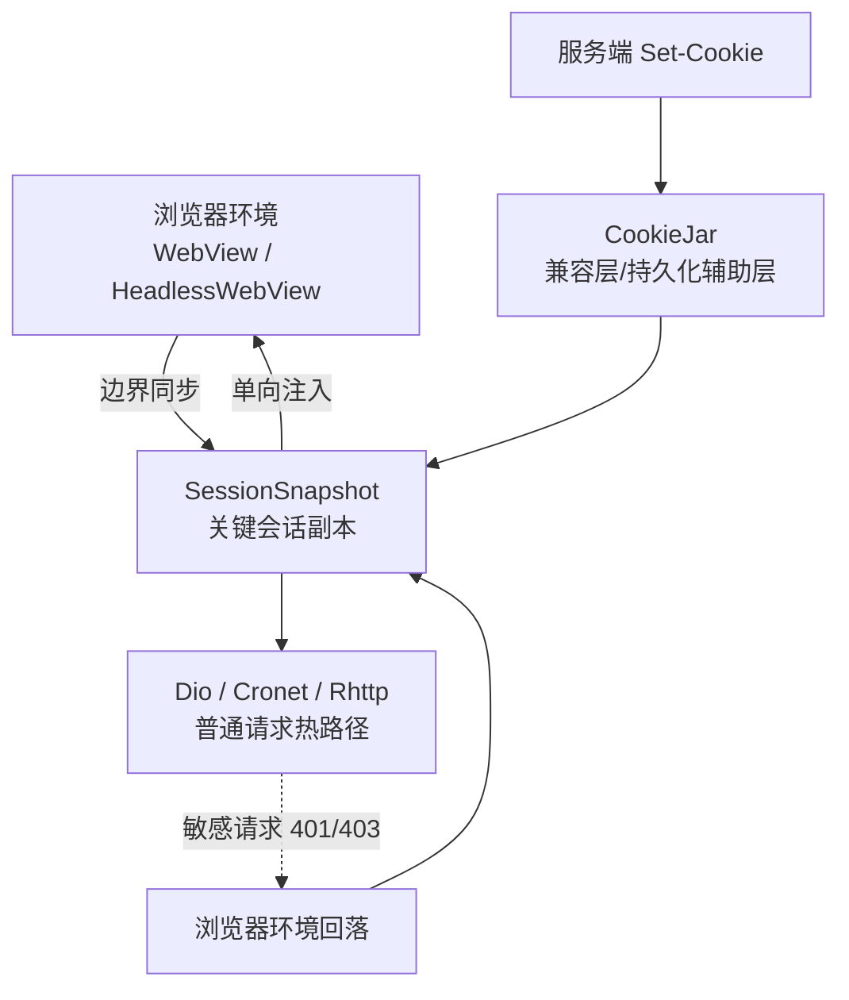
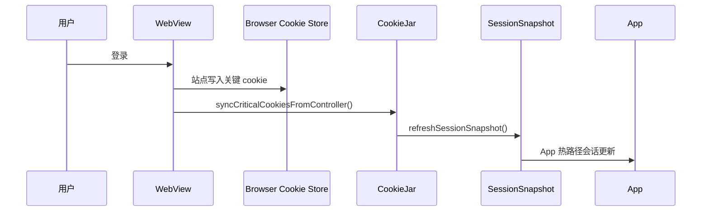
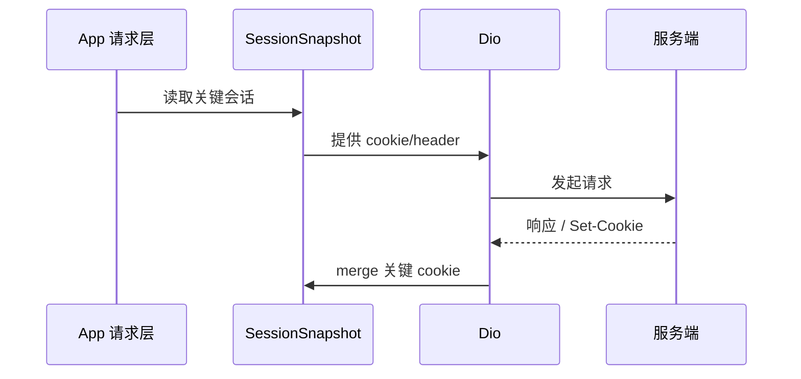
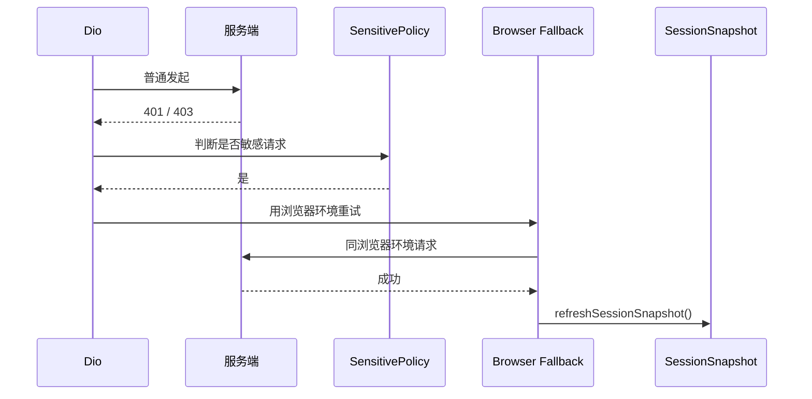

# Cookie / 会话架构现状

## 结论

当前实现已经不再是“WebView 和 `CookieJar` 常态双向同步”。

现在的主策略是：

1. **浏览器环境是认证真相源**
2. **`SessionSnapshot` 是 App 热路径会话副本**
3. **`CookieJar` 退为兼容层 / 持久化辅助层**
4. **敏感请求允许回落到浏览器环境**
5. **只在边界时机做显式会话同步**

这套方案不是“理论完美统一存储”，但在当前约束下更稳，也更符合 Cloudflare/登录态的实际行为。

---

## 为什么这么改

旧模型的问题是：

- WebView 浏览过程中会不断把状态反向写回 App
- App 又会把自己的状态再写回 WebView
- 多套状态持续相互污染
- Cloudflare challenge 在浏览器环境通过，但后续请求却不一定仍在同一环境执行

所以当前改造目标不是“继续把同步做得更频繁”，而是：

- **减少同步**
- **收窄状态范围**
- **保留浏览器环境完整性**

---

## 当前角色分工

### 1. 浏览器环境

包括：

- `InAppWebView`
- `HeadlessInAppWebView`
- 平台 WebView cookie/store/storage

职责：

- 登录
- 登出
- Cloudflare challenge
- 站内 WebView 页面
- 浏览器态敏感请求

### 2. `SessionSnapshot`

位置：

- [session_snapshot_service.dart](../lib/services/network/cookie/session_snapshot_service.dart)

职责：

- 给 App 原生请求热路径提供会话副本
- 只保存关键 cookie
- 避免每次请求都去读取浏览器 cookie store

当前仅保存：

- `_t`
- `_forum_session`
- `cf_clearance`

### 3. `CookieJar`

位置：

- [cookie_jar_service.dart](../lib/services/network/cookie/cookie_jar_service.dart)
- [app_cookie_manager.dart](../lib/services/network/cookie/app_cookie_manager.dart)

职责：

- 兼容现有 Dio `Set-Cookie` 写入链
- 作为过渡期持久化层
- 为 `SessionSnapshot` 提供初始化来源

它**不再应该被理解成浏览器认证真相源**。

### 4. `BrowserSessionService`

位置：

- [browser_session_service.dart](../lib/services/network/browser_session_service.dart)

职责：

- 统一边界同步入口
- 统一登录 / CF / 浏览器回落后的快照刷新
- 避免登录页、CF 服务、拦截器、适配器各自直接操作 `CookieJarService`

---

## 当前请求策略

### 普通请求

- 默认走 Dio / Cronet / Rhttp
- 使用 `SessionSnapshot`

### 敏感请求

满足以下条件之一的请求会在 `401/403` 时尝试回落到浏览器环境：

- `/topics/timings`
- `/posts`
- `/post_actions`
- `/notifications`
- `/presence`
- `/uploads`
- `/u/.../preferences`

相关文件：

- [request_sensitivity_policy.dart](/D:/teng/Documents/i/ldx/lib/services/network/request_sensitivity_policy.dart)
- [browser_request_fallback_service.dart](/D:/teng/Documents/i/ldx/lib/services/network/browser_request_fallback_service.dart)
- [_auth.dart](/D:/teng/Documents/i/ldx/lib/services/discourse/_auth.dart)

### 浏览器专属请求

以下场景直接留在浏览器环境：

- 登录
- Cloudflare challenge
- WebView 页面内部请求

---

## 流程图

### 整体状态流

### 登录收口

### 普通请求

### 敏感请求回落

---

## 这次改造后已经发生的变化

### 已移除

- `WebViewPage` 普通浏览过程中的常态 `syncFromWebView`
- 将浏览器普通浏览状态持续回灌到 App 的行为

### 已新增

- `SessionSnapshotService`
- `syncSessionSnapshotFromWebView(...)`
- 敏感请求浏览器环境回落

### 已保留但角色变化

- `CookieJar` 仍存在，但主职责已弱化
- Android CDP 仍保留，但不再适合作为主流程依赖

---

## Android CDP 现状

位置：

- [android_cdp_feature.dart](/D:/teng/Documents/i/ldx/lib/services/network/cookie/android_cdp_feature.dart)
- [android_cdp_service.dart](/D:/teng/Documents/i/ldx/lib/services/network/cookie/android_cdp_service.dart)

当前定位：

- 诊断
- 高可信观测
- 少量兜底

不再建议：

- 作为热路径依赖
- 在 Cloudflare challenge 关键路径上频繁轮询 `awaitTargetReady`

当前默认策略：

- **Android CDP 默认关闭**
- 老用户升级后通过迁移强制切到关闭
- 用户仍可手动开启

---

## 显式边界同步时机

仅在以下时机回收浏览器会话：

- 登录成功
- Cloudflare challenge 成功
- 浏览器环境回落成功
- WebView 请求链路完成后需要收口时
- 清理/恢复会话时

不再在以下场景同步：

- 普通 WebView 浏览 `loadStop`
- 普通历史跳转
- 浏览器内部无关 cookie 波动

---

## 迁移状态

### `cookie_clean_slate_v2`

- 历史 `EnhancedPersistCookieJar` 切换迁移
- 清理旧 cookie 存储

### `cookie_clean_slate_v3`

- 浏览器优先双通道切换迁移
- 对存量用户执行一次**全量 Cookie 清理**
- 清理范围：
  - `CookieJar`
  - WebView cookie store
  - `SessionSnapshot`
- 执行后要求重新登录

### `android_native_cdp_default_off_v1`

- Android 老用户升级后，强制将 `pref_android_native_cdp` 设为 `false`
- 新用户默认也是关闭

迁移文件：

- [migration_service.dart](/D:/teng/Documents/i/ldx/lib/services/migration_service.dart)

---

## 现在还不够优雅的地方

虽然已经比旧模型健康，但当前仍有一些交叉职责：

1. **会话读取入口仍不完全单一**
   仍存在 `CookieJar`、快照、浏览器直接读取等多种入口

2. **会话写入入口仍偏多**
   服务端响应、登录收口、CF 收口、恢复逻辑都可能触发更新

3. **边界同步点分散**
   已开始收敛到 `BrowserSessionService`，但还不是所有会话入口都完全统一

4. **`CookieJar` 仍是历史兼容主角**
   还没有完全降级为纯兼容层

---

## 什么叫“更优雅”

如果后续继续收口，目标应该是：

1. App 热路径**只读 `SessionSnapshot`**
2. 浏览器环境作为唯一认证真相源
3. `CookieJar` 只保留兼容与持久化辅助职责
4. 浏览器 -> App 会话回收统一走一个 orchestrator

也就是说，后续“更优雅”的方向不是再加更多同步逻辑，而是：

- **减少入口**
- **减少职责重叠**
- **固定主从关系**

---

## 关键文件

### 会话快照

- [session_snapshot_service.dart](../lib/services/network/cookie/session_snapshot_service.dart)

### Cookie 管理

- [cookie_jar_service.dart](../lib/services/network/cookie/cookie_jar_service.dart)
- [app_cookie_manager.dart](../lib/services/network/cookie/app_cookie_manager.dart)
- [cookie_write_through.dart](../lib/services/network/cookie/cookie_write_through.dart)

### 浏览器回落

- [browser_session_service.dart](../lib/services/network/browser_session_service.dart)
- [request_sensitivity_policy.dart](../lib/services/network/request_sensitivity_policy.dart)
- [browser_request_fallback_service.dart](../lib/services/network/browser_request_fallback_service.dart)
- [webview_http_adapter.dart](../lib/services/network/adapters/webview_http_adapter.dart)

### 登录 / CF 收口

- [webview_login_page.dart](../lib/pages/webview_login_page.dart)
- [cf_challenge_service.dart](../lib/services/cf_challenge_service.dart)
- [cf_challenge_interceptor.dart](../lib/services/network/interceptors/cf_challenge_interceptor.dart)

### 迁移

- [migration_service.dart](../lib/services/migration_service.dart)

---

## 当前建议

短期内继续坚持这 4 条：

1. 不再恢复常态双向同步
2. 不再新增新的会话读入口
3. 不再新增新的浏览器 -> App 同步入口
4. 敏感请求优先浏览器环境兜底，而不是继续强化 cookie 同步
