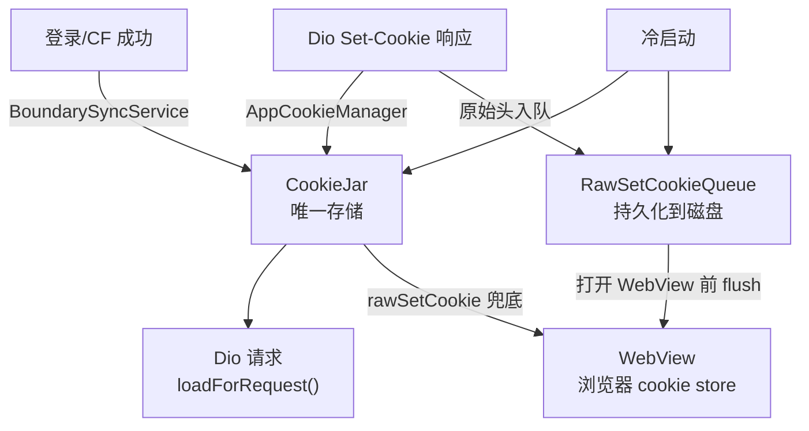
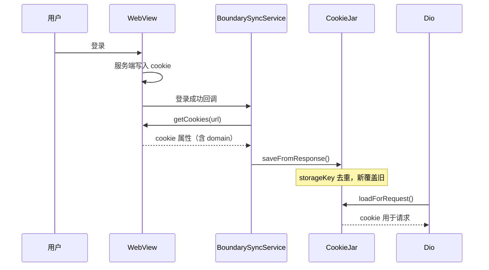
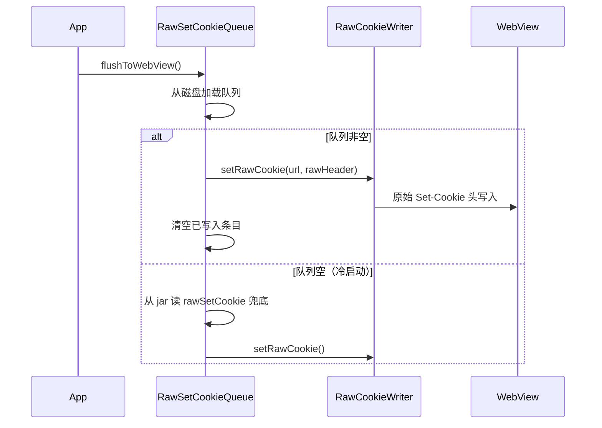

# Cookie 架构

## 版本历史

| 版本 | 模型 | 问题 |
|------|------|------|
| v0.1.x | WebView ↔ CookieJar 双向常态同步 | 多套状态互相污染；cookie 属性在跨平台同步中丢失 |
| v0.2.0 | 浏览器优先 + SessionSnapshot | 去掉常态同步，但保留了复杂的 strategy/coordinator 层 |
| v0.2.3 | 边界同步 + BrowserSessionService | 进一步收敛同步入口，但 hostOnly 推断错误导致多副本 bug |
| **v0.3.0** | **CookieJar 唯一存储 + 原始头队列** | **本次重构。删除 strategy/coordinator/snapshot，storageKey 放宽** |

## 当前架构（v0.3.0）

### 核心规则

**一个 Cookie 在一个域名下不可能出现两次。** `(name, normalizedDomain, path)` 是唯一 identity，新的替换旧的。

### 角色分工

| 组件 | 职责 |
|------|------|
| `CookieJar` (`EnhancedPersistCookieJar`) | cookie 唯一存储，持久化到磁盘 |
| `BoundarySyncService` | 边界同步：登录/CF 成功时从 WebView 读 cookie 写入 jar |
| `RawSetCookieQueue` | Dio 原始 Set-Cookie 头持久化队列，打开 WebView 时刷入 |
| `AppCookieManager` | Dio 拦截器：请求加载 cookie、响应保存 Set-Cookie |
| `CsrfTokenService` | CSRF token 管理（原 CookieSyncService） |

### 数据流



### 边界同步时序



### 打开 WebView 时序



---

## 平台 cookie 属性获取能力

WebView `CookieManager.getCookies()` 在各平台返回的字段：

| 平台 | API | domain | httpOnly | secure | path | expires | sameSite |
|------|-----|--------|----------|--------|------|---------|---------|
| **Android (新 WebView)** | `CookieManagerCompat.getCookieInfo()` | ✅ | ✅ | ✅ | ✅ | ✅ | ✅ |
| **Android (旧 WebView)** | `CookieManager.getCookie()` | ❌ | ❌ | ❌ | ❌ | ❌ | ❌ |
| **iOS / macOS** | `WKHTTPCookieStore.getAllCookies()` | ✅ | ✅ | ✅ | ✅ | ✅ | ✅ |
| **Windows** | CDP `Network.getCookies` | ✅ | ✅ | ✅ | ✅ | ✅ | ✅ |
| **Linux** | WPE `getAllCookies()` | 待验证 | 待验证 | 待验证 | 待验证 | 待验证 | 待验证 |

### Android 详细说明

Android 的 `flutter_inappwebview` (`MyCookieManager.java`) 有两条路径：

```java
if (WebViewFeature.isFeatureSupported(WebViewFeature.GET_COOKIE_INFO)) {
    // 新路径：返回完整 Set-Cookie 格式字符串
    // Domain=, HttpOnly, Secure, Path, SameSite, Expires 全部包含
    cookies = CookieManagerCompat.getCookieInfo(cookieManager, url);
} else {
    // 旧路径：只返回 "name1=value1; name2=value2"
    cookiesString = cookieManager.getCookie(url);
}
```

- `GET_COOKIE_INFO` 在 `androidx.webkit 1.6.0`（2023 年 1 月）引入
- 对应 Chrome WebView ~114+（2023 年 5 月）
- 运行时通过 `WebViewFeature.isFeatureSupported()` 检测
- 2026 年绝大多数设备已支持（WebView 通过 Play Store 自动更新）

### 旧 Android 兜底策略

当 `GET_COOKIE_INFO` 不支持（domain 为 null）时：

1. **优先继承 jar 中已有的 domain**（来自之前的 Dio Set-Cookie 响应）
2. **jar 也没有 → 兜底为 `.{host}`**（domain cookie，覆盖子域名）
3. 后续 Dio 响应的 Set-Cookie 会用正确属性覆盖

---

## storageKey 设计说明

### 当前 storageKey

```dart
storageKey = jsonEncode([name, normalizedDomain, path, partitionKey])
```

### 与 RFC 6265bis 的差异

RFC 6265bis (Section 5.7, Step 23) 定义 cookie identity 包含 `host-only-flag`：

> If the cookie store contains a cookie with the same name, domain, host-only-flag, and path...

本项目故意去掉 `hostOnly`，原因：

1. **各平台 WebView API 无法可靠还原 hostOnly**（Android 旧设备完全没有，新设备也依赖运行时 feature check）
2. **保留 hostOnly 会导致同名 cookie 以不同 hostOnly 共存**——这正是 v0.2.x 多副本 bug 的根因
3. **实际场景中同域名同名 cookie 不应有两份**——服务端不会同时发 host-only 和 domain 两个版本的同名 cookie

去掉 hostOnly 后，`hostOnly` 仍作为 `CanonicalCookie` 的字段保留（影响 `loadForRequest` 的匹配行为），只是不再参与去重。

---

## 关键文件

### Cookie 存储

- [cookie_jar_service.dart](../lib/services/network/cookie/cookie_jar_service.dart) — 统一 cookie 管理服务
- [app_cookie_manager.dart](../lib/services/network/cookie/app_cookie_manager.dart) — Dio 拦截器

### 同步

- [boundary_sync_service.dart](../lib/services/network/cookie/boundary_sync_service.dart) — WebView → jar 边界同步
- [raw_set_cookie_queue.dart](../lib/services/network/cookie/raw_set_cookie_queue.dart) — jar → WebView 原始头队列

### 基础设施

- [cookie_logger.dart](../lib/services/network/cookie/cookie_logger.dart) — 统一日志
- [csrf_token_service.dart](../lib/services/network/cookie/csrf_token_service.dart) — CSRF token 管理
- [cookie_value_codec.dart](../lib/services/network/cookie/cookie_value_codec.dart) — RFC 6265 值编码
- [raw_cookie_writer.dart](../lib/services/network/cookie/raw_cookie_writer.dart) — 原生平台 Set-Cookie 写入

### Android CDP（可选）

- [android_cdp_feature.dart](../lib/services/network/cookie/android_cdp_feature.dart) — 功能开关（默认关闭）
- [android_cdp_service.dart](../lib/services/network/cookie/android_cdp_service.dart) — 原生 CDP 通道

### enhanced_cookie_jar 包

- [canonical_cookie.dart](../packages/enhanced_cookie_jar/lib/src/canonical_cookie.dart) — Cookie 模型
- [enhanced_persist_cookie_jar.dart](../packages/enhanced_cookie_jar/lib/src/enhanced_persist_cookie_jar.dart) — 持久化 jar
- [set_cookie_parser.dart](../packages/enhanced_cookie_jar/lib/src/set_cookie_parser.dart) — Set-Cookie 解析
- [file_cookie_store.dart](../packages/enhanced_cookie_jar/lib/src/file_cookie_store.dart) — 文件存储

### 消费方

- [webview_login_page.dart](../lib/pages/webview_login_page.dart) — 登录收口
- [webview_page.dart](../lib/pages/webview_page.dart) — WebView 页面
- [cf_challenge_service.dart](../lib/services/cf_challenge_service.dart) — CF 验证
- [cf_challenge_interceptor.dart](../lib/services/network/interceptors/cf_challenge_interceptor.dart) — CF 拦截器
- [webview_http_adapter.dart](../lib/services/network/adapters/webview_http_adapter.dart) — WebView HTTP 适配器

### 迁移

- [migration_service.dart](../lib/services/migration_service.dart) — 含 `cookie_relaxed_key_v4`

---

## 迁移历史

| key | 版本 | 作用 |
|-----|------|------|
| `cookie_clean_slate_v2` | v0.2.0 | `EnhancedPersistCookieJar` 切换迁移 |
| `cookie_clean_slate_v3` | v0.2.3 | 浏览器优先双通道切换迁移 |
| `android_native_cdp_default_off_v1` | v0.2.3 | Android CDP 默认关闭 |
| `cookie_relaxed_key_v4` | v0.3.0 | storageKey 放宽，清理旧 cookie |
